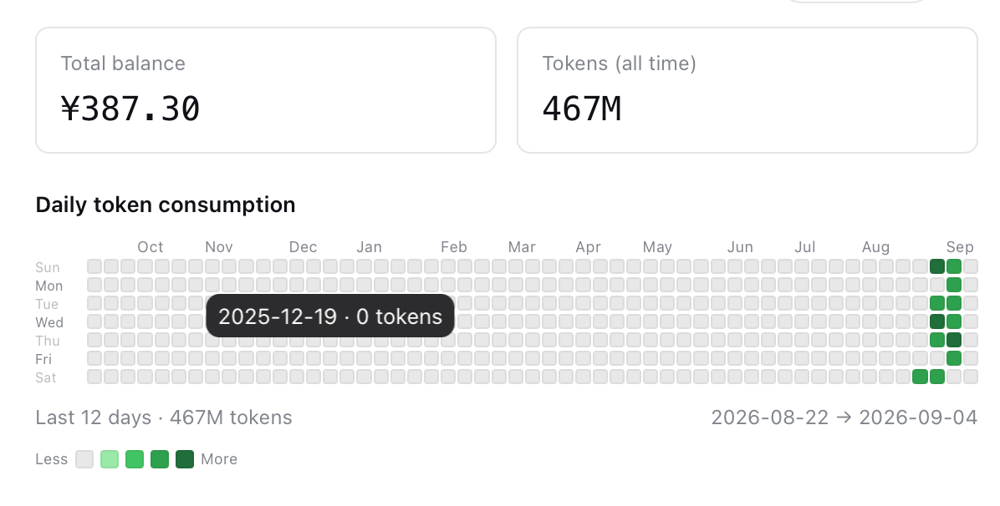
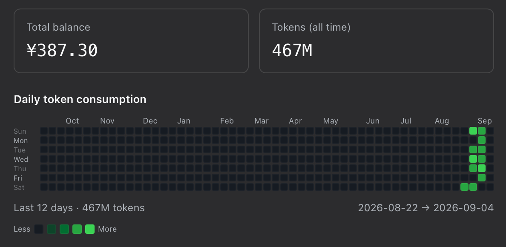

# usage-heatmap

English | [中文](README.zh.md)

An external (out-of-tree) plugin for [DeepSeek Harness](https://github.com/deepseek-ai/deepseek-harness).
It adds a “Usage” item to the settings menu, displaying a **daily token usage
heatmap** similar to GitHub contributions, along with account balance and total
token summaries.

## Preview

### Light



### Dark



## Features

- **Daily token heatmap**: Aggregates token usage for each LLM request by local
  calendar day (input + output + cache-read + cache-write). Each cell represents
  one day. A neutral empty state and four fixed logarithmic levels use GitHub's
  mode-aware contribution palettes in light and dark themes.
- **Summary cards**: Total balance and all-time Token total.
- **Window statistics**: Displays the total token count for the most recent N
  days below the heatmap.
- **Persistence across restarts**: Daily history is written atomically to
  `$DSH_HOME/usage-heatmap/daily-usage.json` (with 0600 permissions), so data is
  preserved across restarts.

> Note: The official public API (`/user/balance`) returns only the balance and
> **does not provide Total Cost**. The spending amount shown on the official site
> comes from a private dashboard API on platform.deepseek.com, which is accessible
> only to authenticated browser sessions and does not support API key authentication.
> This plugin therefore tracks only token counts and balance; it does not estimate
> monetary cost.

## Architecture

| Data | Channel | Description |
|---|---|---|
| Daily token history | **host aggregation + webserver route** | The host listens for `session/event`, folds usage events by day, and persists them atomically. The browser polls `/usage-heatmap/history` to retrieve the data. |
| Account balance | **webserver route** | The host periodically calls DeepSeek `GET /user/balance` and caches the result, which is returned together with history by the route. |

History is an account-level materialized aggregate built from persisted session
logs and live usage events, while balance is also account-level data. Neither is
a per-session projection, so the plugin serves them through a dedicated Web route
without appending synthetic events to the durable session log.

```
┌─ host (node) ───────────────────────────┐   ┌─ browser ──────────────────┐
│ ctx.on('session/event')                 │   │ settings.section            │
│   usage → DailyUsageStore (daily rollup)│   │   └─ Usage page             │
│     → $DSH_HOME/usage-heatmap/*.json    │   │       ├─ Summary cards      │
│ setInterval → GET /user/balance (cache) │   │       └─ TokenHeatmap       │
│ webServer /usage-heatmap/history ───────▶│──▶│       (30s history polling) │
└──────────────────────────────────────────┘   └────────────────────────────┘
```

## Directory Structure

```
dsh-usage-heatmap/
├── package.json              # Private package; dsh.client declaration; exports["./client"]
├── cordis.patch.yml          # Bundle mounts the host half during installation
├── tsconfig.json             # Editor type checking
├── tsconfig.build.json       # Declaration build
├── build.mjs                 # esbuild builds the host bundle + client bundle
├── src/
│   ├── index.ts              # host half: daily aggregation + balance query + history route
│   ├── daily-usage.ts        # DailyUsageStore: daily aggregation + atomic persistence
│   └── client/
│       ├── index.ts          # client half: settings.section registration
│       ├── UsageHeatmap.tsx  # Heatmap + summary cards + useHistory hook
│       └── UsageHeatmapSection.tsx  # Settings page component
└── lib/                      # Build artifacts (committed to the repository)
```

## Installation

The repository includes the host, client, and declaration artifacts. Users do
not need to run `pnpm install` or rebuild the plugin:

```sh
git clone https://github.com/MoriTang/dsh-usage-heatmap.git
```

Register it with the `web` profile from a Harness checkout:

```sh
cd /path/to/deepseek-harness
pnpm dsh plugin --profile web add /absolute/path/to/dsh-usage-heatmap
```

`cordis.patch.yml` mounts the host half automatically, and the package manifest
loads the Web client half. Restart `pnpm dsh web` after registration.

Remove it with:

```sh
pnpm dsh plugin --profile web remove dsh-usage-heatmap
```

## Develop

Source development requires a DeepSeek Harness checkout. Place both repositories
under the same parent directory:

```text
src/
├── deepseek-harness/
└── dsh-usage-heatmap/
```

The plugin resolves DSH development dependencies through
`link:../deepseek-harness/...`; standard build tools come from npm:

```sh
cd /path/to/dsh-usage-heatmap
pnpm install
pnpm run typecheck
pnpm test
pnpm run build
```

This release targets the DeepSeek Harness `0.1.2-alpha.2` series. Harness does
not yet promise stable compatibility, so rerun these checks and verify the Web
UI after upgrading Harness.

## Configuration

The bundle supplies defaults. To override them, add an id-targeted entry to
`~/.dsh/profiles/web/cordis.patch.yml`; do not insert a second Loader entry:

```yaml
- id: usage-heatmap
  config:
    apiKeyEnv: 'DEEPSEEK_API_KEY'
    baseURL: 'https://api.deepseek.com'
    refreshMs: 60000
    historyDays: 90
```

Configuration reloads after saving. Refresh the browser, and the “Usage” item
will appear in the settings menu.

| Field | Default | Description |
|---|---|---|
| `apiKeyEnv` | `DEEPSEEK_API_KEY` | Credential reference for the API key (environment variable name) |
| `baseURL` | `https://api.deepseek.com` | Base URL of the API endpoint; `/user/balance` is appended to it |
| `refreshMs` | `60000` | Balance refresh interval in milliseconds |
| `historyDays` | `365` | Number of recent days displayed in the heatmap |

Configuration changes take effect immediately after saving (config-only HMR),
without a restart.

## Verification

- **history route**: `curl http://127.0.0.1:3080/usage-heatmap/history` should
  return `{"days":[{date,tokens}...],"totals":{"tokens":...},"balance":{...},"checkedAt":...,"lastError":null}`.
- **client bundle**: `curl http://127.0.0.1:3080/plugins/dsh-usage-heatmap/client.js`
  should return HTTP 200 and `window.__ModuleLoader__.load({...})`.
- **Type checking**: `pnpm run typecheck`.

## Tests

```sh
cd /path/to/dsh-usage-heatmap
pnpm install
pnpm test
```

11 cases cover `DailyUsageStore` invariants: dual usage-event extraction and
full-field summation, model attribution (header switches / `unknown`),
same-(turn, step) replacement (including zero-out cleanup), independent
per-session accumulation, snapshot ordering/truncation/detached copies,
backfill watermarks, `persist:false` zero-write, `adopt` copy semantics,
`dispose` synchronous flush + reload consistency, and `load` tolerance.

## Known Limitations

- **Refresh the page after changing client source code; restart after changing
  host source code**: The web profile disables module-level HMR. After modifying
  `src/client/*`, rebuild and **refresh the browser** for the changes to take
  effect. Changes to the host half (`src/index.ts`, `src/daily-usage.ts`) require
  restarting `dsh web`. Edits to the `cordis.patch.yml` configuration are
  hot-reloaded and do not require a restart.
- **History source**: Startup backfills persisted session logs, then live usage
  events continue the history. If one session cannot be read, the plugin retains
  the last successfully persisted history file.
- **Read-only balance**: The balance is queried only for display; no top-up or
  spending operations are included. If the API request fails, the last successful
  value is retained and `lastError` is recorded.
- **No Total Cost**: The official API does not provide a spending amount (see the
  note above). This plugin deliberately avoids estimating monetary cost to prevent
  discrepancies with official billing.
- The plugin `name` must be the **package name** (`dsh-usage-heatmap`) because
  client modules scan `dsh.client` declarations by package name.
